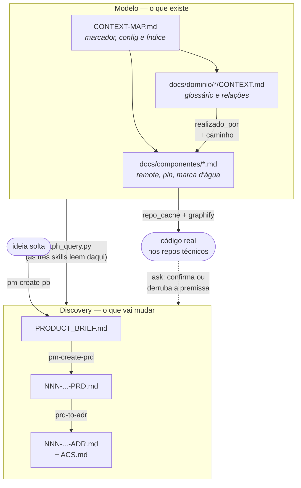

# context-repo

Repositório documental da POC Home Assistant. Não contém código executável — descreve,
em dois eixos que se correlacionam, os 7 repositórios do produto clonados em `../`:

- **domínio de produto (DDD)** — quais capacidades existem e com que linguagem se fala
  delas;
- **arquitetura técnica as-is** — quais repositórios de código realizam cada capacidade,
  e em que ponto do código.

O elo entre os dois é o que dá valor ao repositório: a partir de uma pergunta em
linguagem de negócio, chegar ao código que a responde.

## O formato: front matter, e só

Não existe arquivo gerado, nem arquivo de configuração separado. **Todo dado
estrutural mora no front matter de um markdown**, e o markdown continua legível sem
nenhuma ferramenta.

```
CONTEXT-MAP.md              ← ponto de entrada, marcador do repo e config
docs/dominio/<slug>/CONTEXT.md   ← um contexto de domínio: glossário e relações
docs/componentes/<nome>.md       ← um repositório de código: onde está, em que revisão
```

O `CONTEXT-MAP.md` é o único ponto de entrada: **o que ele não alcança não existe**
para as ferramentas. Um documento fora do mapa é invisível, e é por isso que
`scripts/validate.py` trata órfão como erro.

A configuração do repo é o front matter do próprio mapa:

```yaml
product: POC Home Assistant
owner: home-assistant
system: home-assistant
repos_root: ..
domain_docs: docs/dominio
component_docs: docs/componentes
```

### Por que não um catálogo gerado

Este repositório já teve um `catalog-info.yaml` no formato Backstage, gerado a partir
dos mesmos markdowns por um build step, com um hook de pre-commit que existia só para
detectar quando o gerado divergia da fonte. O arquivo foi removido: um artefato
derivado e versionado só cria uma segunda verdade para manter em dia. O que se perde é
compatibilidade com um Backstage real; o que se ganha é que drift entre fonte e
catálogo passa a ser impossível por construção, em vez de detectável.

## A correlação domínio → código

Declarada uma vez só, no front matter do `CONTEXT.md`, na direção da consulta:

```yaml
realizado_por:
  - componente: core
    caminho: homeassistant/components/automation
  - componente: core
    caminho: homeassistant/components/script
```

`caminho` é opcional — omitido, vale o repositório inteiro. Ele existe para que o
escopo de leitura do código seja **dado**, não heurística: sem ele, uma pergunta sobre
automação obrigaria a varrer os 619MB do `core`. Vale declará-lo quando o componente é
grande demais para ser lido inteiro com qualidade; nos outros (o maior depois do `core`
tem 222MB) ele só adiciona uma chance de apontar para o lugar errado.

| Contexto | Componentes |
|---|---|
| [Automation & State Engine](./docs/dominio/automation-state-engine/CONTEXT.md) | `core` (5 caminhos) |
| [Integration Platform](./docs/dominio/integration-platform/CONTEXT.md) | `core` (3 caminhos) |
| [Add-on & System Management](./docs/dominio/addon-system-management/CONTEXT.md) | `supervisor`, `operating-system` |
| [Client Experience](./docs/dominio/client-experience/CONTEXT.md) | `frontend`, `android`, `ios` |
| [Build & Distribution](./docs/dominio/build-distribution/CONTEXT.md) | `docker` |

Os 5 contextos **não mapeiam 1:1** com os 7 repositórios: `core` realiza dois contextos,
e três repositórios realizam juntos o `Client Experience`.

## Duas revisões por componente, com donos diferentes

Cada doc em `docs/componentes/` carrega:

```yaml
commit: 3fb456fa1fe4abbe6b89367b98f282043e9b02dd        # o pin
ultimo_visto: 3fb456fa1fe4abbe6b89367b98f282043e9b02dd  # a marca d'água
```

- **`commit` é o pin.** Descreve o código que esta documentação afirma descrever. Só
  um humano o move, com `--pin`. É o que um PB/PRD/ADR cita quando diz "conforme o
  commit X" — e é por isso que ele não pode ser um alvo móvel.
- **`ultimo_visto` é a marca d'água.** `--update-refs` a atualiza sozinho. É o "como
  está hoje", que uma pergunta sobre o comportamento atual do produto quer.

`commit != ultimo_visto` é, literalmente, o sinal de que o componente está descasado: o
código andou e a documentação ainda não foi conferida contra ele.

## Scripts

Stdlib-only, sem dependências externas. Nada de nome de produto hardcoded: tudo vem do
front matter do `CONTEXT-MAP.md`.

- **`scripts/validate.py`** — integridade referencial. Roda no pre-commit e nunca
  escreve: falha com a instrução do que rodar.
  ```bash
  python3 scripts/validate.py             # valida tudo
  python3 scripts/validate.py --offline    # não baixa nada; o que faltar vira aviso
  ```
  Pega link quebrado no mapa, documento órfão, `realizado_por` citando componente
  inexistente, relação apontando para contexto que não existe, e `caminho` que o
  upstream moveu — este último conferido contra o código real.

- **`scripts/scan_repos.py`** — descobre os repositórios clonados em `../` e mantém os
  docs de componente em dia.
  ```bash
  python3 scripts/scan_repos.py                # dry-run: o que encontrou e o que divergiu
  python3 scripts/scan_repos.py --write        # cria os docs dos componentes novos
  python3 scripts/scan_repos.py --update-refs  # atualiza ultimo_visto (nunca o pin)
  python3 scripts/scan_repos.py --pin          # promove o pin para o ultimo_visto
  ```

- **`scripts/install_hooks.py`** — instala o pre-commit que roda o `validate.py`.
  ```bash
  python3 scripts/install_hooks.py
  ```

- **`scripts/context_config.py`** — módulo compartilhado: acha a raiz do repo, lê a
  config do mapa e itera contextos/componentes. Não reimplementa o parser de front
  matter: importa o da skill `blueprintfy`, que é a fonte única do formato.

## Como atualizar

Quando um dos repositórios em `../` mudar de tag/commit:

```bash
python3 scripts/scan_repos.py                # o que divergiu?
python3 scripts/scan_repos.py --update-refs  # atualiza a marca d'água
```

O pin fica onde está de propósito. Depois de conferir que a documentação ainda descreve
o código novo:

```bash
python3 scripts/scan_repos.py --pin
```

## O fluxo

O repositório sustenta duas coisas que se alimentam: um **modelo** (o que existe, com
que nome, realizado por que código) e um **discovery** (o que vai mudar). Ambos são
markdown com front matter, e o `CONTEXT-MAP.md` alcança os dois.



Quem escreve o quê:

| Skill | Escreve | Nunca escreve |
|---|---|---|
| `blueprintfy` | glossário, relações, contratos | discovery |
| `scan_repos.py` | docs de componente (remote, ref, marca d'água) | glossário, pin |
| `context-repo-bootstrap` | o esqueleto, componentes novos | conteúdo de domínio |
| `pm-create-pb` / `pm-create-prd` / `prd-to-adr` | `docs/discovery/<assunto>/` | o modelo |
| `ask` | **nada** — só lê e apresenta | tudo |

## Fluxo: construir o domínio

Quem escreve o domínio é sempre a skill `blueprintfy` — nunca à mão, para o glossário
não degradar. Ela roda em dois modos, e decide sozinha qual usar:

**Modo 1 — bootstrap.** Só quando `CONTEXT-MAP.md` ainda não existe (ver "Como criar
um do zero" abaixo). Depois da primeira execução, este modo não roda de novo.

**Modo 2 — sessão contínua.** O modo do dia a dia: nomear um termo novo, questionar um
termo vago, registrar uma relação entre contextos, decidir uma ADR de arquitetura.
Invoque descrevendo o que precisa modelar:

```
/blueprintfy essa consulta de aplicabilidade parte de um Device ou de um Blueprint —
              qual dos dois é o "dono" da pergunta?
```

Ela lê o `CONTEXT-MAP.md` primeiro, entrevista uma pergunta de cada vez com resposta
recomendada, cruza contra o código quando o usuário descreve comportamento, e grava
inline no `CONTEXT.md` do contexto certo assim que um termo é validado — nunca
acumula para depois.

O que sai de uma sessão, em ordem de raridade:

1. **Um termo no glossário** (`## Linguagem` do `CONTEXT.md`) — o caso comum.
2. **Uma relação nova** no front matter: `depende_de` (acoplamento), `dominio_pai`
   (hierarquia), ou `compartilha_contrato_com` (um conceito que atravessa dois
   contextos — vira aresta no grafo, com o nome do contrato).
3. **`realizado_por`** — liga o contexto ao componente técnico e, quando o
   componente for grande, ao caminho dentro dele.
4. **Uma ADR** — só quando a decisão for difícil de reverter, surpreendente sem
   contexto, e resultado de um trade-off real; as três condições ao mesmo tempo.

**Exemplo real deste repositório.** `docs/dominio/automation-state-engine/CONTEXT.md`
tinha o glossário de Automation/Script/Scene, mas nada dizia que `Blueprint` — um
molde reutilizável de automação — e `Device Automation` — o que um tipo de
dispositivo já oferece pronto — existiam no código. Uma sessão do `blueprintfy`:

- nomeou os dois termos, com definição de negócio, sem detalhe de implementação;
- percebeu que `Device Automation` cruza dois contextos (`Device` é do
  `Integration Platform`, `Trigger`/`Action` são do `Automation & State Engine`) e
  registrou um **segundo contrato compartilhado** entre eles, ao lado do `Entity`
  que já existia;
- declarou os dois caminhos novos em `realizado_por`
  (`homeassistant/components/blueprint`, `.../device_automation`).

Confira em `docs/dominio/automation-state-engine/CONTEXT.md` e
`docs/dominio/integration-platform/CONTEXT.md` — front matter e `## Linguagem`.

O gate depois de qualquer mudança: o documento tocado é alcançável a partir do
`CONTEXT-MAP.md`? Se for um contexto novo, ele precisa de uma entrada na seção
`## Contextos`. `scripts/validate.py` confere isso — e mais: todo `caminho` novo em
`realizado_por` é conferido contra o código real, não só contra o front matter.

## Fluxo: gerar um discovery

Três skills em cadeia, uma pergunta de cada vez, nenhuma escreve sem checkpoint:

```
/pm-create-pb   tive uma ideia: <descreva em texto livre>
/pm-create-prd  detalha o PB-<id>
/prd-to-adr     arquitetura do PRD-<id>
```

**`pm-create-pb`** lê o `CONTEXT-MAP.md` **antes de perguntar qualquer coisa** — é
esse reconhecimento que permite abrir já dizendo "essa ideia toca os contextos X e Y,
e Y compartilha o contrato Z com um terceiro". Se a ideia esbarra numa decisão já
registrada, ela argumenta o conflito e espera confirmação antes de escrever o PB.

**`pm-create-prd`** primeiro decide **quantos** PRDs a ideia pede — a pergunta central
não é "como escrever o requisito", é "isto é um PRD ou são três". Quatro critérios:
contextos tocados, atores com jornadas distintas, se as capacidades são acopladas ou
entregáveis em separado, e o custo de reverter cada uma. A proposta de quebra é
mostrada e argumentada **antes** de qualquer arquivo existir.

**`prd-to-adr`** propõe a arquitetura, decompõe em atividades por componente, e gera
Acceptance Criteria com ID (`RF-01`, `RNF-01`) rastreável até o requisito de origem —
nenhuma AC sem requisito, nenhum requisito sem AC.

**Exemplo real deste repositório**, em `docs/discovery/automacao-por-dispositivo-novo/`:

1. A entrevista do PB parou na segunda pergunta — o `ask` foi ao código e achou que
   `Blueprint` e `Device Automation` já existiam, sem nome em glossário nenhum (ver
   "Fluxo: construir o domínio" acima). O PB só foi escrito depois, e o escopo virou
   o delta real em vez da ideia original.
2. A hipótese de três capacidades independentes não sobreviveu ao teste par a par: a
   dependência real era `001 → 002 → 003`, não três PRDs soltos — testar "B funciona
   sem A?" para cada par é o que revelou isso.
3. O primeiro `prd-to-adr` seguiu o contrato que a família de comandos WebSocket já
   usava no código, e registrou uma divergência deliberada de um requisito
   (`RF-05`) na seção *Consequências* da ADR, em vez de escondê-la.

Todo documento gerado passa pelo mesmo gate: alcançável a partir do `CONTEXT-MAP.md`
(seção `## Planejamento (to-be)`), ou a entrega está incompleta.

## Como usar

### Perguntar como o produto funciona

```
/ask como uma automação reage quando um dispositivo muda de estado?
```

A skill acha o contexto pelo significado, resolve componente e caminho, baixa o código
se não estiver na máquina, roda o `/graphify` e responde em linguagem de produto. Sem
a skill, os mesmos passos à mão:

```bash
# 1. que código realiza este contexto (e os subcontextos dele)?
python3 .claude/skills/blueprintfy/scripts/graph_query.py realiza "Automation & State Engine"

# 2. resolver para um diretório de verdade
python3 -c "
import sys; sys.path.insert(0, '.claude/skills/blueprintfy/scripts')
import repo_cache, graph_query
from pathlib import Path
fm = graph_query.parse_frontmatter(Path('docs/componentes/core.md').read_text())
print(repo_cache.resolve('core', fm, Path('.'), rev='latest').path)"

# 3. graficar o caminho declarado e perguntar
```

### Consultar o grafo direto

```bash
GQ=.claude/skills/blueprintfy/scripts/graph_query.py

python3 $GQ realiza "<Contexto>"              # que código realiza isto
python3 $GQ vigentes "<Contexto>"             # PB/PRD/ADR vivos x superados
python3 $GQ impacto adr:ADR-<id> --saltos 5   # o que uma decisão alcança
python3 $GQ valida-aresta "A" "B" --contrato X  # essa integração fura o contexto?
python3 $GQ ciclos                            # acoplamento circular entre contextos
```

## Como criar um do zero

Use a skill `context-repo-bootstrap`, que conduz as seis fases e traz os scripts
prontos. O resumo do que ela faz, para quem quiser entender antes de rodar:

```bash
# 1. esqueleto, ao lado dos repositórios técnicos
mkdir -p meu-context-repo/{scripts,docs/dominio,docs/componentes,docs/discovery}
cd meu-context-repo && git init

# 2. CONTEXT-MAP.md com o front matter de config — ANTES de qualquer script rodar,
#    porque é ele que marca a raiz do repositório
# 3. .gitignore — ANTES do primeiro commit (.graphs/ e .repo-cache/ aparecem cedo)

# 4. componentes, automático
python3 scripts/scan_repos.py --write

# 5. domínio, pela entrevista (ver "Fluxo: construir o domínio" acima)
/blueprintfy  começar a modelagem de domínio aqui

# 6. fechar a correlação: realizado_por em cada CONTEXT.md folha
# 7. guarda
python3 scripts/install_hooks.py && python3 scripts/validate.py
```

A ordem importa em dois pontos: o mapa precede tudo (é o marcador), e o `.gitignore`
precede o primeiro commit.

## Cuidados

**Documento fora do mapa não existe.** É o modo de falha mais silencioso do padrão:
nada quebra, o arquivo está lá, e nenhuma consulta o encontra. `validate.py` trata
órfão como erro — de `CONTEXT.md`, de doc de componente e de PB/PRD/ADR. Ao criar
qualquer documento, registre no mapa no mesmo movimento.

**Não recrie um artefato gerado.** Se der vontade de "materializar um índice
consolidado" a partir dos markdowns, não faça: é a segunda verdade que este formato
existe para não ter. Uma view em memória, montada na hora e descartada, é o padrão
certo — é o que o `graph_query.py` faz.

**A correlação tem uma direção só.** `realizado_por` mora no `CONTEXT.md`, nunca no doc
do componente. Declarar nos dois sentidos parece conveniente e é como o de-para acaba
divergindo.

**`commit` é pin, `ultimo_visto` é marca d'água.** Nunca mova o `commit` só porque o
upstream andou — isso apaga a âncora de todo PB/PRD/ADR que o citou. `commit !=
ultimo_visto` não é erro a consertar: é o aviso de que alguém precisa conferir a
documentação contra o código novo. `--pin` é o ato deliberado que registra "conferi".

**`caminho` errado é pior que `caminho` nenhum.** Omitido, vale o repositório inteiro —
o que é o certo para a maioria. Declare só onde o componente for grande demais para ser
lido inteiro com qualidade, e lembre que um caminho pode ter referências apontando para
fora dele (foi assim que `components/blueprint` foi descoberto: `components/automation`,
que estava declarado, importava de lá).

**Nunca grave um termo de glossário sem validar.** Um termo errado se propaga para todo
documento que o cita depois. Quem valida é a entrevista do `blueprintfy`.

**O `ask` não escreve, e isso não é limitação.** Quando ele encontra uma lacuna,
repassa: `blueprintfy` para linguagem, `context-repo-bootstrap` para componente ou
caminho. Um único escritor por tipo de documento é o que impede o modelo de degradar.

**As skills estão versionadas aqui porque este é um repositório de exemplo — não
copie essa prática para um context-repo de produto.** Lá, versionar significa que
editar a cópia local não conserta a fonte, e um bug corrigido no catálogo não chega
sozinho. Ignore `.claude/skills/` de propósito e instale do catálogo
(`lup-skills add blueprintfy ask ...`); sem `blueprintfy` instalada, os scripts param
com mensagem explícita — `context_config.py` importa dela o parser de front matter.

### Limitações conhecidas do grafo

- **`contextos:` não vira aresta.** Só `afeta` cria aresta no `graph_query.py`. O
  contexto *principal* de um PB/PRD/ADR é invisível para o `impacto` — o `vigentes`
  acerta, porque lê `contextos`. Se precisar que o principal apareça na travessia,
  liste-o também em `afeta`.
- **`impacto` sub-reporta caminhos.** Ele dedupa por nó, então um componente com sete
  caminhos declarados aparece com um só. Quem lista todos é o `realiza`.

## Ferramentas

**Este é um repositório de exemplo, e por isso as seis skills do fluxo estão
versionadas em `.claude/skills/`** — para quem clonar ver o fluxo inteiro sem
precisar instalar nada do catálogo primeiro. Num context-repo de produto real a
prática recomendada é a oposta: não versionar, instalar do catálogo (ver "Cuidados").
`evals/` (fixtures de teste de cada skill) fica de fora mesmo aqui — não é conteúdo
do fluxo, é ferramenta de quem desenvolve a skill.

| Skill | Papel |
|---|---|
| `blueprintfy` | modelo de domínio; **obrigatória** — dela vêm `graph_query.py` e `repo_cache.py` |
| `context-repo-bootstrap` | cria o repositório do zero, estende com componente ou contexto novo |
| `ask` | pergunta de negócio → código, sem escrever nada |
| `pm-create-pb` · `pm-create-prd` · `prd-to-adr` | discovery: ideia → PB → PRD → ADR + ACs |
| `graphify` | **não** versionada aqui (é código de terceiro, não deste catálogo) — lê o código e monta o grafo sob demanda |

Todas vêm do catálogo `luishpcosta/ai-lup-skills`, que é onde se contribui uma
correção ou melhoria — editar a cópia aqui não propaga para lá. O que as skills
escrevem (`CONTEXT-MAP.md`, `CONTEXT.md`, docs de componente, `docs/discovery/`) é
sempre versionado e continua legível mesmo sem nenhuma delas instalada.

O `blueprintfy` não é só a mais importante: as outras cinco dependem dela em tempo de
execução (`scripts/context_config.py` importa dela o parser de front matter,
`ask`/`validate.py` importam o `repo_cache.py`). Sem ela, os scripts param com uma
mensagem dizendo isso.
