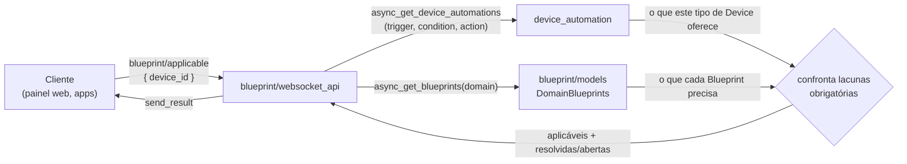

# ADR-20260823-1606-448c: Aplicabilidade de Blueprint calculada sob demanda, exposta em `blueprint/applicable`

## Contexto

O PRD-20260823-1552-0f65 pede uma resposta para "dado este Device, quais Blueprints se
aplicam a ele". As duas metades da informação já existem no `core` e nunca se
encontraram: `device_automation` sabe o que cada tipo de Device oferece,
`blueprint` sabe o que cada Blueprint precisa.

Três coisas do código já estavam decididas antes desta ADR, e ela as respeita em vez de
reabrir:

- **O transporte.** A família de comandos WebSocket já existe e tem forma clara:
  `device_automation/{trigger,condition,action}/list` recebem `device_id`;
  `blueprint/list` recebe `domain`. A consulta nova é irmã dessas, não um transporte
  novo.
- **A fonte da aplicabilidade.** `async_get_device_automations(hass, automation_type,
  device_ids)` já devolve as automações por Device, resolvendo o registro de Devices e
  Entities. Não há motivo para reimplementar essa travessia.
- **A forma da resposta.** `blueprint/list` devolve um mapa por caminho de Blueprint,
  com `metadata` no caso bom e `error` no caso ruim.

Este é o primeiro ADR do repositório: não há decisão anterior a respeitar nem a superar.

## Requisitos atendidos

| Requisito | Como |
|---|---|
| RF-01 | O comando `blueprint/applicable` recebe `device_id` e devolve os Blueprints aplicáveis |
| RF-02 | Aplicabilidade = as Device Automations do tipo satisfazem todas as lacunas obrigatórias do Blueprint |
| RF-03 | Cada Blueprint na resposta traz `resolvidas` e `abertas` separadas |
| RF-04 | Device sem Device Automations devolve mapa vazio, com sucesso — mesma convenção de `blueprint/list` para domínio desconhecido |
| RF-05 | Blueprint malformado entra na resposta com `error`, não derruba a consulta — **ver Consequências: refinamento deliberado do requisito** |
| RF-06 | A avaliação parte de todos os Blueprints do domínio, sem distinguir importados de locais |
| RNF-01 | Orçamento de 200ms p95 para instalação com até ~200 Blueprints |
| RNF-02 | A consulta só lê; nenhuma escrita em Automation, Blueprint ou Config Entry |
| RNF-03 | Sem estado intermediário: o mesmo Device e o mesmo conjunto de Blueprints produzem o mesmo resultado por construção |
| RNF-04 | Toda a avaliação é local; Blueprints já importados são lidos do disco |

## Decisão

**Calcular a aplicabilidade sob demanda, sem estado derivado, e expor o resultado como
um comando WebSocket novo `blueprint/applicable`.**



A cada consulta: obter as Device Automations do `device_id` pelos três tipos, obter os
Blueprints dos domínios `automation` e `script`, e confrontar. Um Blueprint é aplicável
quando toda lacuna que ele declara obrigatória é satisfeita por alguma Device
Automation daquele Device.

O comando entra na família `blueprint/` porque é isso que ele devolve, e porque
`blueprint/list` é a consulta irmã — uma filtra por domínio, a outra por Device. A
consequência aceita é que `blueprint` passa a depender de `device_automation`.

**Contrato de `blueprint/applicable`:**

Requisição:

| campo | tipo | obrigatório | nota |
|---|---|---|---|
| `type` | string | sim | literal `blueprint/applicable` |
| `device_id` | string | sim | id do Device no registro |
| `domain` | string | não | restringe a um domínio de Blueprint; omitido, considera `automation` e `script` |

Resposta (`send_result`): mapa com o caminho do Blueprint como chave, no mesmo formato
que `blueprint/list` já usa.

```json
{
  "blueprints/automation/homeassistant/motion_light.yaml": {
    "metadata": { "name": "Motion-activated Light", "domain": "automation" },
    "resolvidas": { "motion_entity": "binary_sensor.porta_sala" },
    "abertas": ["light_target"]
  },
  "blueprints/automation/quebrado.yaml": {
    "error": "Missing input definition: trigger_entity"
  }
}
```

Erros, usando os códigos que o `websocket_api` já define:

| cenário | código |
|---|---|
| `device_id` inexistente no registro | `ERR_NOT_FOUND` |
| `device_id` ausente ou com tipo errado | `ERR_INVALID_FORMAT` (validação do schema) |
| falha ao ler os Blueprints do disco | `ERR_UNKNOWN_ERROR` |

**Idempotência:** a consulta é leitura pura (RNF-02). Repetir a chamada com os mesmos
argumentos e o mesmo conjunto de Blueprints devolve o mesmo resultado (RNF-03); não há
retry a tratar nem chave de deduplicação a definir.

## Alternativas consideradas

**Índice mantido `tipo de Device → Blueprints`, atualizado em import/save/delete.**
Tornaria a consulta O(1) e removeria a dependência do orçamento de RNF-01 sobre o
número de Blueprints. Descartada por criar uma segunda fonte de verdade derivada, que
precisa ser mantida em sincronia com os Blueprints no disco — a Premissa 3 do PRD diz
explicitamente que isso só se justifica se o conjunto deixar de ser pequeno. Enquanto
os 200ms couberem, o custo de sincronia não se paga.

**Sob demanda com memoização por tipo de Device.** Meio-termo: barato na repetição, mas
transforma RNF-03 (determinismo) numa propriedade que depende da correção da
invalidação, em vez de decorrer da construção. Descartada por trocar uma garantia
estrutural por uma garantia operacional sem necessidade demonstrada.

**Comando em `device_automation/blueprint/list`.** Agruparia pela forma da pergunta
(todos os comandos que recebem `device_id` vivem lá) e manteria a dependência no
sentido em que já existe. Descartada porque quem consome está procurando Blueprints, e
`blueprint/list` é a consulta irmã — agrupar pelo que se devolve foi julgado mais
descobrível que agrupar pelo argumento.

**Módulo novo, neutro entre os dois.** Evitaria dar dependência a qualquer módulo
existente. Descartada pelo custo: um terceiro lugar para procurar, e um nome novo — que
neste repositório é termo de glossário novo, devolvendo a conversa para a modelagem de
domínio antes de haver necessidade.

## Consequências

**Positivas**

- Sem estado derivado: RNF-02 e RNF-03 decorrem da construção, não de disciplina.
- Nada é migrado nem alterado no que já existe; a decisão é aditiva e reversível —
  remover o comando devolve o sistema ao estado atual.
- O PRD-003 herda folga: com 200ms p95 aqui, o orçamento de tempo da oferta cabe.

**Negativas e aceitas**

- `blueprint` passa a depender de `device_automation`. Dependência nova entre módulos
  que hoje não se conhecem.
- O custo da consulta cresce com o número de Blueprints. Se a Premissa 3 do PRD cair,
  esta decisão precisa ser revista — e a revisão é uma ADR nova que a supera, não um
  remendo com cache.

**Refinamento deliberado do RF-05.** O requisito diz que um Blueprint malformado é
"omitido do resultado". Esta ADR o **inclui** na resposta com `error`, seguindo a
convenção que `blueprint/list` já usa. A intenção do requisito — não derrubar a
consulta inteira por causa de um Blueprint quebrado — é atendida nos dois casos; a
convenção existente atende melhor, porque o cliente consegue distinguir "não se aplica"
de "está quebrado". Divergir do requisito aqui é decisão desta ADR e fica registrada
como tal.

## Componentes afetados

- **`core`** — único componente. Toda a decisão vive em
  `homeassistant/components/blueprint/` e consome `homeassistant/components/device_automation/`,
  ambos caminhos declarados no `realizado_por` do contexto Automation & State Engine.

Nenhum componente cliente (`frontend`, `android`, `ios`) é afetado por esta ADR: eles
entram no PRD-20260823-1552-7f27.
